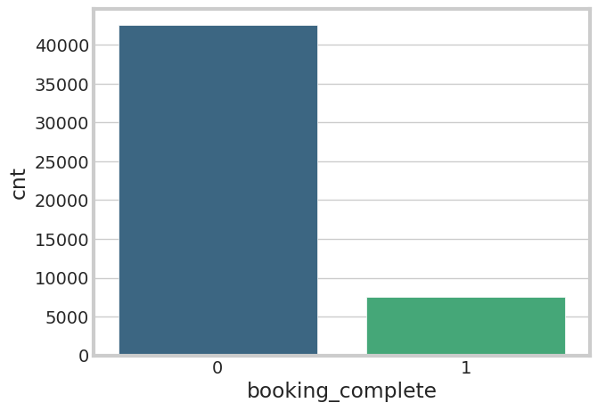
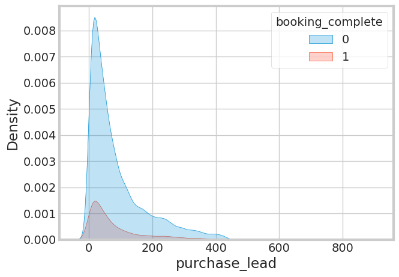
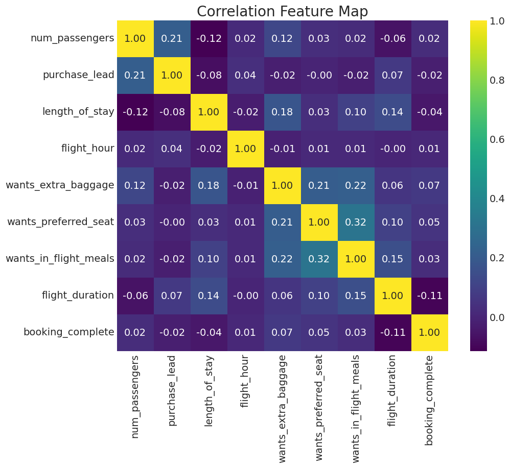
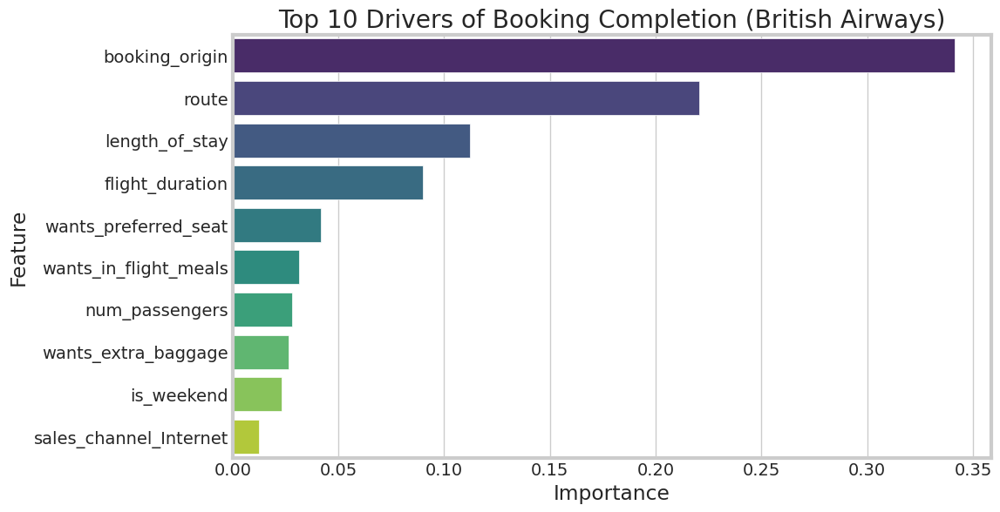

# ✈️ Airline Customer Booking Prediction using Machine Learning

<div align="center">

### Predicting Customer Booking Completion using Machine Learning & Advanced Classification Techniques


</div>

---

# 📌 Project Overview

This project focuses on predicting whether a customer will complete a flight booking using Machine Learning techniques.

The project includes:

* Exploratory Data Analysis (EDA)
* Feature Engineering
* Data Preprocessing Pipelines
* Handling Imbalanced Data using SMOTE & SMOTEENN
* Random Forest & XGBoost Models
* Hyperparameter Optimization using Optuna
* Threshold Tuning
* Feature Importance Analysis
* Model Serialization using Pickle

---

# 🎯 Business Problem

Airlines receive thousands of booking inquiries, but not every customer completes the booking process.

The objective of this project is to build a predictive Machine Learning model capable of identifying customers likely to complete bookings using customer behavior, travel details, and service preferences.

### Business Benefits

✅ Better customer targeting
✅ Improved marketing strategies
✅ Increased booking conversion rates
✅ Data-driven business decisions
✅ Enhanced customer engagement

---

# 📂 Dataset Features

## 🔢 Numerical Features

* `num_passengers`
* `purchase_lead`
* `length_of_stay`
* `flight_duration`

## 🏷️ Categorical Features

* `route`
* `booking_origin`
* `sales_channel`
* `trip_type`
* `wants_extra_baggage`
* `wants_preferred_seat`
* `wants_in_flight_meals`

## 🎯 Target Variable

* `booking_complete`

---

# ⚙️ Machine Learning Workflow


---

# 📊 Exploratory Data Analysis (EDA)

Performed detailed Exploratory Data Analysis to:

* Understand customer booking behavior
* Analyze feature distributions
* Detect class imbalance
* Identify important influencing factors
* Study relationships between variables
* Discover patterns affecting booking completion

---

# 📸 Booking Completion Distribution



---

# 📸 Purchase Lead Analysis



---

# 📸 Correlation Heatmap



---

# 🛠️ Data Preprocessing Pipeline

An end-to-end preprocessing pipeline was implemented using Scikit-learn.

## Pipeline Components

### ✅ Numerical Feature Processing

* Applied `StandardScaler` to numerical features

### ✅ Categorical Feature Processing

* Applied `OneHotEncoder` to categorical variables

### ✅ Imbalanced Data Handling

* Used `SMOTE` and `SMOTEENN` techniques
* Improved minority class prediction performance

### ✅ Pipeline Integration

* Combined preprocessing and modeling into a reusable workflow

---

# 🔄 Preprocessing & Modeling Pipeline

```python
preprocessor = ColumnTransformer(transformers=
  [('tnf1',StandardScaler(),['num_passengers','length_of_stay','purchase_lead','flight_duration']),
   ('tnf2',OneHotEncoder(handle_unknown='ignore',sparse_output=False),
    ['route','booking_origin','sales_channel','trip_type',
     'wants_extra_baggage','wants_preferred_seat','wants_in_flight_meals'])
   ],
   remainder='passthrough'
)

pipe = Pipeline(
    [('tnf1',preprocessor),
     ('smote',SMOTEENN()),
     ('model', RandomForestClassifier(n_estimators=100))]
)
```

---

# 🤖 Machine Learning Models Used

## 1️⃣ Random Forest Classifier

Used as the baseline model.

### Advantages

* Handles non-linear patterns effectively
* Reduces overfitting using ensemble learning
* Provides feature importance interpretation

### Observation

* Achieved good accuracy
* However, recall was very low because of dataset imbalance
* Failed to identify minority class effectively

---

## 2️⃣ XGBoost Classifier ✅ Final Model

Implemented:

* Hyperparameter tuning using Optuna
* Threshold optimization
* Imbalance handling
* Performance optimization

### Why XGBoost was selected?

✅ Better Recall
✅ Better minority class prediction
✅ Balanced Precision & Recall
✅ Better business usefulness

---

# 📈 Model Evaluation

## Evaluation Metrics Used

* Accuracy
* Precision
* Recall
* F1-Score
* ROC-AUC Score
* Cross Validation

---

# 📊 Model Comparison

| Model         | Accuracy | Recall   | Observation                                  |
| ------------- | -------- | -------- | -------------------------------------------- |
| Random Forest | High     | Very Low | Failed to predict minority class effectively |
| Tuned XGBoost | Balanced | Improved | Better practical business performance        |

---


# 🔍 Feature Importance Analysis

Feature importance analysis was performed to identify variables contributing most to booking completion prediction.

## Most Important Features

* `booking_origin`
* `purchase_lead`
* `length_of_stay`
* `flight_duration`
* `route`

---

# 📸 Feature Importance Visualization



---

# 💡 Key Insights

* `booking_origin` strongly influences booking completion
* Customers with shorter `purchase_lead` are more likely to complete bookings
* `length_of_stay` significantly impacts customer behavior
* Flight-related features contribute meaningfully to predictions
* Customers selecting additional services show higher booking probability
* Threshold tuning improved practical business usefulness
* Class imbalance significantly affected baseline model performance

---

# 💾 Model Serialization using Pickle

The final tuned XGBoost pipeline was saved using Pickle for deployment and future predictions.

```python
import pickle

with open("customer_booking_model.pkl", "wb") as f:
    pickle.dump(final_pipeline, f)
```

---

# 📁 Project Structure

```bash
flight-booking-prediction-ML/
│
├── data/
│   └── customer_booking.csv
│
├── images/
│   ├── banner.jpg
│   ├── images/End-to-End Machine Learning Workflow for Customer Booking Prediction. - visual selection.png
│   ├── images/booking_complete_distribution.png
│   ├── purchase_lead_analysis.png
│   ├── images/corr_heatmap_ba.png
│   └── images/features_imp_ba.png
│   
├── model/
│   └── customer_booking_model.pkl
│
├── notebook/
│   └── Customer_booking_prediction.ipynb
│
├── README.md
└── requirements.txt
```

---

# 🚀 Future Improvements

* Deploy model using Flask/FastAPI
* Build interactive prediction web application
* Apply advanced feature engineering
* Experiment with LightGBM and CatBoost
* Improve handling of high-cardinality categorical features
* Optimize threshold dynamically

---

# 🧠 Skills Demonstrated

* Exploratory Data Analysis
* Data Preprocessing Pipelines
* Handling Imbalanced Datasets
* Machine Learning Model Development
* Hyperparameter Optimization
* Threshold Tuning
* Feature Importance Interpretation
* End-to-End ML Workflow
* Model Serialization & Deployment Preparation

---

# ⭐ Final Conclusion

This project successfully developed an end-to-end Machine Learning pipeline capable of predicting customer booking completion.

Although Random Forest achieved strong accuracy, the tuned XGBoost model demonstrated significantly better practical usefulness by improving minority class prediction and recall.

The project highlighted the importance of:

* Proper preprocessing
* Imbalance handling
* Threshold tuning
* Hyperparameter optimization
* Model evaluation beyond accuracy

in solving real-world classification problems.

---

# 👩‍💻 Author

## Arti Nighote

Artificial Intelligence & Data Science Student

Passionate about:

* Machine Learning
* Data Science
* AI Applications
* Predictive Analytics
* Problem Solving

---

<div align="center">

### ⭐ If you found this project useful, consider giving it a star ⭐

</div>

